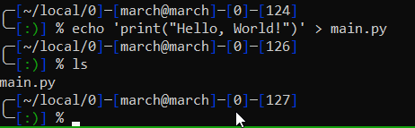

## 1. Основы работы с СКВ в графическом режиме

#### Установка графического клиента git Cola

sudo apt update
sudo apt install git-cola
git-cola

#### Выберем в клиенте директорию /home/march/local/0

Инициализируйте в этой директории репозиторий гит.

#### Создание файла

#### Совершение коммита

Жмем "Добавить к коммиту"

В описание коммита добавим "Init", далее нажимаем Commit

Сейчас визуализация ветки master выглядит так

Изменяем файл: 

Совершаем коммит "Add math equation main.py"

#### Выберем последний совершенный коммит в визуализации ветки и нажмем "Обратить изменения этого коммита"

#### Таким образом создается новый коммит с отмененными изменениями последнего коммита. Чтобы отменить отмену изменений жмем "Сбросить ветку master на этот коммит" выбрав предыдущий коммит.

#### В данном случае можем выбрать "Жесткий" переход, так как следы от отката коммита нам не нужны

### Контрольные вопросы

#### Рабочий каталог

Директория, в которой находятся файлы проекта.

#### Репозиторий

Хранилище, содержащее историю изменений и текущую версию проекта.

#### Коммит

Фиксация изменений в репозитории.

#### Ветка

Линия разработки в репозитории

## 2. Работа с Git в терминале

Для этой работы все использованные команды сохранены в `2.txt`

1. Выберите тематику программы, которую собираетесь написать. Создайте для нее рабочую директорию
2. Инициализируйте в рабочей директории репозиторий при помощи команды git init.
3. Выполните в репозитории команду git status. Проинтерпретируйте полученное сообщение.

4. Создайте файл для исходного текста программы. Выполните команду git status.
5. Добавьте созданный файл под версионный контроль при помощи команды git add. Еще раз выполните git status.
6. Сделайте начальный коммит при помощи команды git commit с опцией -m.

7. Сделайте еще несколько коммитов. Выполните команду git log для просмотра истории коммитов.

8. Сделайте так, чтобы при коммите измененные файлы автоматически добавлялись в коммит.

использована команда:

`git config --global alias.cm 'commit -am'`

9. Добавьте еще несколько файлов с исходным текстом программы. 
10.  Добавьте все новые файлы под версионный контроль одной командой. 
11. На всех стадиях работы пользуйтесь командой git status.

12. Инициализируйте в рабочей директории виртуальное окружение (Если вы пишите не на Python, то можете инициализировать какой-либо программный фреймворк, либо начать работать в IDE, которая создает скрытую папку с настройками в рабочем каталоге).
13. Добавьте созданную служебную папку в файл .gitignore. Проверьте, что они не добавляются в репозитории при добавлении новых файлов с исходным кодом. 

14. Создайте новую тематическую ветку git branch. Перейдите в нее с помощью git checkout. Выведите на экран список всех веток.

15. Сделайте несколько коммитов в основную и тематическую ветки. 

16. Слейте изменения в основную ветку с помощью git merge. Если произошел конфликт слияния, разрешите его и завершите слияние с помощью git commit.

17. При получении в процессе разработки программы в стабильно работающем состоянии, слейте это состояние в основную ветку и добавьте к коммиту слияния пометку с номером релиза.

### Контрольные вопросы
#### Что такое удаленный репозиторий?

Это копия репозитория, которая хранится в интернете (например, на GitHub). Он нужен для хранения и совместной работы.

#### Где нужно вводить команды git?

В терминале или командной строке.

#### Как возникают конфликты слияния

Когда два человека меняют одну и ту же часть файла в разных ветках, и Git не знает, какие изменения оставить.

#### Для чего нужны ветки в системах контроля версий?

Чтобы каждый член команды, участвующий в разработке, мог работать над кодом, при этом не изменяя основную его версию.

#### Как разрешать конфликты слияния?

Открыть файл с конфликтом, выбрать нужные изменения, удалить лишнее, сохранить и сделать коммит.

## 3. Работа с удаленными репозиториями и GitHub

Для этой работы все использованные команды сохранены в `3.txt`

1. Зарегистрироваться на сайте github.com
2. Установить на компьютере программу Git
3. Форкнуть данный репозиторий в свой аккаунт
4. Склонировать созданный удаленный репозиторий в директорию ~/git/test
	
5. На локальной машине пишем скрипт ~/git/test/backup.sh, с произвольным содержанием
	
6. Фиксируем скрипт в репозитории (делаем коммит)
	
7. Обновляем удаленный репозиторий репозиторий (делаем пуш)
	
8. Через текстовый редактор добавить любую новую строку с комментарием
	
9. Сделать коммит
	
10. Вности синтаксическую ошибку в скрипт
	
11. Сделать коммит ошибочного скрипта
	
12. Откатываем до последней рабочей версии
	
	
13. Просмотреть историю коммитов
	
### Контрольные вопросы

#### Зачем нужен облачный хостинг репозиториев?

Для хранения кода, совместной работы и доступа к проекту из любого места.

#### Какими основными функциями обладает сайт github.com?

- Хранение кода.
- Совместная работа.
- Управление задачами.
- Просмотр истории изменений.
- Хостинг сайтов.

#### Как организовать командную работу над открытым проектом?

- Создать репозиторий.
- Добавить участников.
- Разделить задачи с помощью `Issues`.
- Работать в ветках и отправлять изменения через `Pull Requests`.
